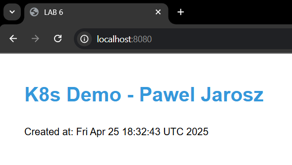
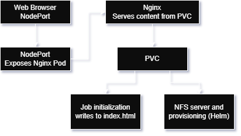

# LSC-Kubernetes

Demo kubernetes app for Large Scale Computing Course 2025

## Solution

### Installation

For this lab I used minikube. I also used windowds machine with WSL. After installing minikube I have run it using command:

```bash
minikube start --driver=docker --memory=4096 --cpus=2
```

After installing **Helm** I installed the NFS server provisioner using:

```bash
helm install nfs-server-provisioner stable/nfs-server-provisioner \
  --set storageClass.name=nfs-storage \
  --set persistence.enabled=true \
  --set persistence.size=10Gi

# verified using:
kubectl get pods
kubectl get storageclass
```

### Creating PVC

I have created a configuration file describing Persistent Volume Claim called `pvc.yaml`. I then applied it using

```bash
kubectl apply -f pvc.yaml

# verified using:
kubectl get pvc
```

### Deployment with HTTP server

I have created a server deployment configuration in file `deployment.yaml`, and then applied it using:

```bash
kubectl apply -f deployment.yaml

# verified using:
kubectl get deployments
kubectl get pods
```

### Service for the HTTP server

I have created server service ocnfiguration file `service.yaml`.

```bash
kubectl apply -f service.yaml

# verified using:
kubectl get services
```

### Job

I have created a job file with simple html content in `job.yaml`.

```bash
kubectl apply -f job.yaml

# verified using:
kubectl get jobs
kubectl get pods
```

To access the server run on WSL from my host machine I ran:

```bash
kubectl port-forward service/web-server-service 8080:80
```

The following page was accessible under localhost:8080 on my host machine:


## Architecture Diagram

Simple diagram:


Roles of architecture elements:
- **Minikube**: A lightweight Kubernetes implementation that creates a local cluster
- **Helm**: A package manager for Kubernetes
- **NFS Server Provisioner**: A storage solution that dynamically provisions NFS.
- **StorageClass**: A Kubernetes resource that defines the provisioner and parameters for dynamically creating storage volumes.
- **Persistent Volume Claim (PVC)**: A request for storage by a user that is fulfilled by binding to a Persistent Volume.
